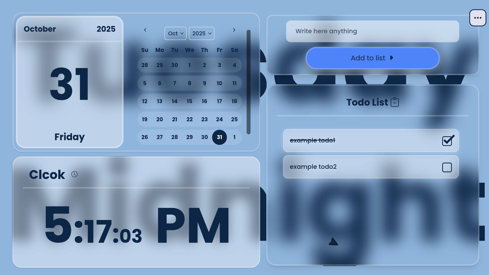

# 📝 PlanPulse - Modern Todo Application

<div align="center">


A beautiful, feature-rich todo list application with advanced customization, drag-and-drop functionality, stunning glassmorphism design, and powerful widget system. Built with React 19, Vite, and modern web technologies.

[](https://reactjs.org/)
[](https://vitejs.dev/)
[](https://tailwindcss.com/)
[](./LICENSE)

[Live Demo](https://planpulse.vercel.app) · [Report Bug](https://github.com/aarab-abderrahmane/PlanPulse/issues) · [Request Feature](https://github.com/aarab-abderrahmane/PlanPulse/issues)

</div>

---

## ✨ Features

<table>
<tr>
<td width="50%">

### 📋 Core Functionality
- ✏️ **Quick Task Creation** - Add tasks instantly with validation
- 🎯 **Drag & Drop** - Reorder tasks and widgets with smooth animations
- ✅ **Task Completion** - Animated checkboxes with satisfying interactions
- 📝 **Inline Editing** - Edit tasks directly in place
- 🗑️ **Smart Deletion** - Confirmation dialogs for safety
- 💾 **Auto-save** - All changes persist automatically
- 📤 **Import/Export** - Backup and restore your todos as JSON
- 🔒 **Task Masking** - Hide sensitive tasks with blur effect
- 🎨 **Context Menu** - Right-click for quick actions

</td>
<td width="50%">

### 🎨 Customization & Design
- 🌈 **9 Theme System** - Beautiful color schemes (Blue, Red, Yellow, Green, Purple, Orange, Teal, Pink, Gray)
- 🖼️ **10+ Backgrounds** - Pre-loaded patterns or upload custom images
- 🖱️ **Cursor Styles** - Smooth animated or default cursor
- 👁️ **Hide/Show UI** - Toggle text visibility for minimal interface
- 🔆 **Opacity Control** - Adjust text transparency (0-100%)
- 📐 **Corner Radius** - Customize border radius (0-3rem)
- 📱 **Fully Responsive** - Seamless experience on all devices
- 🎭 **Glassmorphism UI** - Modern frosted-glass aesthetic
- 🎯 **Button Customization** - Show/hide edit and delete buttons

</td>
</tr>
</table>

### 🧩 Widget System

- 📅 **Live Calendar** - Interactive calendar widget with month/year selection
- ⏰ **Detailed Clock** - Real-time clock with AM/PM display
- 🔄 **Customizable Layout** - Drag and reorder widgets with two modes:
  - **Items Mode** - Reorder calendar and clock widgets
  - **Sections Mode** - Swap entire widget sections
- 💫 **Smooth Animations** - All interactions feel polished and responsive

### ⌨️ Enhanced UX

- 🎊 **Celebration Effects** - Confetti animations on milestones
- 🔔 **Toast Notifications** - Color-coded feedback for all actions
- 🌊 **Framer Motion** - Smooth, physics-based animations throughout
- ⚡ **Keyboard Shortcuts** - Fast navigation (Ctrl+B, Ctrl+Y)
- 🎯 **Floating Dock** - Quick access to important actions
- 🎬 **Welcome Stepper** - Interactive onboarding for new users
- 🎨 **Landing Page** - Beautiful animated introduction

## 🎬 Demo




## 🚀 Quick Start

### Prerequisites

- **Node.js** 18+ and npm/yarn/pnpm
- Modern web browser (Chrome, Firefox, Safari, Edge)

### Installation

```bash
# Clone the repository
git clone https://github.com/aarab-abderrahmane/PlanPulse.git
cd PlanPulse

# Install dependencies
npm install

# Start development server
npm run dev

# Open http://localhost:5173 in your browser
```

### Build for Production

```bash
# Create optimized production build
npm run build

# Preview production build locally
npm run preview
```

## 🏗️ Project Structure

```
PlanPulse/
├── src/
│   ├── components/
│   │   ├── ui/                          # shadcn/ui + custom components
│   │   │   ├── accordion.jsx
│   │   │   ├── button.jsx
│   │   │   ├── calendar.jsx
│   │   │   ├── dialog.jsx
│   │   │   ├── dropdown-menu.jsx
│   │   │   ├── floating-dock.jsx        # Dock navigation
│   │   │   ├── smooth-cursor.jsx        # Custom cursor
│   │   │   ├── confetti.jsx             # Celebration effects
│   │   │   ├── in-view.jsx              # Scroll animations
│   │   │   ├── sparkles-text.jsx        # Animated text
│   │   │   └── ... (40+ components)
│   │   ├── TodoList.jsx                 # Main todo container with DnD
│   │   ├── List.jsx                     # Individual todo item (sortable)
│   │   ├── Checkbox.jsx                 # Animated checkbox
│   │   ├── LiveCalendar.jsx             # Calendar widget
│   │   ├── LiveClockDetailed.jsx        # Clock widget
│   │   ├── Preferences.jsx              # Comprehensive settings panel
│   │   ├── DropDownMenuLabo.jsx         # Main dropdown menu
│   │   ├── AlertConfirm.jsx             # Confirmation dialogs
│   │   ├── CodeBlockDemo.jsx            # Code display for export
│   │   └── PreferencesItems/
│   │       └── backgroundAccordion.jsx  # Background carousel
│   ├── landingPage/                     # Landing page components
│   │   ├── indexlanding.jsx             # Main landing page
│   │   ├── button.jsx                   # Animated CTA button
│   │   └── timeline-animation.jsx       # Timeline animations
│   ├── lib/
│   │   └── utils.js                     # Helper functions (cn)
│   ├── App.jsx                          # Root with Preferences context
│   ├── Content.jsx                      # Router wrapper
│   ├── LandingPage.jsx                  # Alternative landing (deprecated)
│   ├── Stipper.jsx                      # Welcome stepper/onboarding
│   ├── ImportDataSection.jsx            # Import functionality
│   ├── ToastContext.jsx                 # Toast notifications context
│   ├── main.jsx                         # Entry point
│   └── index.css                        # Global styles + CSS variables
├── public/
│   ├── backgrounds/                     # Background pattern images
│   ├── planpulse.vercel.app_*.png      # Demo screenshots
│   └── logo.png
├── index.html
├── package.json
├── vite.config.js
├── tailwind.config.js
├── components.json                      # shadcn/ui config
└── README.md
```

## 🧩 Architecture

### State Management

The app uses **React Context API** for comprehensive state management:

```javascript
// Preferences Context - Theme, layout, and UI settings
PreferencesContext = {
  appVersion: "3.0.0",
  corners: 1.5,
  background: { active, id, path },
  customizeLayout: [
    [{ id: 0, type: "calendar" }, { id: 1, type: "clock" }],
    [{ id: 2, type: "todoList" }]
  ],
  general: { hideTexts, opacityTexts },
  cursorType: "default" | "smooth",
  theme_name: string,
  themes: Object,
  buttons: Object,
  dragMode: { active, mode }
}

// Toast Context - Global notifications
ToastContext = {
  showToast: Function
}

// Todos Context - Todo list operations
todosContext = {
  todos: Array,
  setTodos: Function,
  MaskTodo: Function,
  handleAdd: Function,
  handleCheck: Function,
  handleEdit: Function,
  handleSave: Function,
  hanldeDelete: Function
}
```

### Drag & Drop System

Powered by **@dnd-kit** for smooth, accessible drag-and-drop:

```javascript
// Two DnD modes:
// 1. Items Mode - Reorder calendar/clock widgets
// 2. Sections Mode - Swap entire widget sections

DndContext configuration:
- Collision detection: closestCorners
- Strategies: vertical and horizontal list sorting
- Custom drag handlers for both modes
```

### Data Models

```typescript
// Todo Item Structure
interface Todo {
  id: number;              // Unique identifier
  content: string;         // Task description
  modeEdit: boolean;       // Edit mode state
  check: boolean;          // Completion status
  mask: boolean;           // Visibility (blur) state
}

// Widget Structure
interface Widget {
  id: number;
  type: "calendar" | "clock" | "todoList";
}

// Layout Structure
type Layout = Widget[][];  // 2D array for sections

// Theme Structure
interface Theme {
  "--color-background": string;
  "--color-text": string;
  "--color-button": string;
}
```

### Component Hierarchy

```
App (PreferencesContext Provider)
├── ToastContext Provider
│   └── Toaster
├── LandingPage (First-time visitors, route: /)
└── Content (route: /todos)
    ├── SmoothCursor (Optional)
    ├── Background Text Overlay
    ├── DndContext (Main drag system)
    │   ├── Widget Sections (Calendar/Clock)
    │   │   └── SortableContext (Items Mode)
    │   │       ├── GlobalCalendar
    │   │       │   ├── LiveCalendar
    │   │       │   └── react-day-picker Calendar
    │   │       └── LiveClockDetailed
    │   └── TodoList Section
    │       ├── Input (Add new todo)
    │       ├── DndContext (Todo items)
    │       │   └── SortableContext
    │       │       └── List[] (Draggable todos)
    │       │           ├── ContextMenu
    │       │           ├── Checkbox (Animated)
    │       │           ├── Edit/Delete buttons
    │       │           └── Mask toggle
    │       └── DropdownMenuLabo
    │           ├── Preferences Dialog
    │           ├── Import/Export Dialogs
    │           └── AlertConfirm
    ├── FloatingDock (Layout customization mode)
    └── Stipper (Welcome stepper)
```

## 💾 Data Persistence

### localStorage Keys

```javascript
// 1. Todos Data
localStorage.key: 'todos'
Format: Array<Todo>
[
  {
    "id": 1,
    "content": "Learn React",
    "modeEdit": false,
    "check": false,
    "mask": false
  }
]

// 2. Preferences Data
localStorage.key: 'Preferences'
Format: PreferencesObject
{
  "appVersion": "3.0.0",
  "corners": 1.5,
  "background": { "active": false, "id": 0, "path": "" },
  "customizeLayout": [
    [{ "id": 0, "type": "calendar" }, { "id": 1, "type": "clock" }],
    [{ "id": 2, "type": "todoList" }]
  ],
  "general": { "hideTexts": false, "opacityTexts": 100 },
  "cursorType": "smooth",
  "theme_name": "blue",
  "buttons": {
    "buttonDelete": { "active": false },
    "buttonEdit": { "active": true }
  }
}

// 3. Onboarding State
localStorage.key: 'hasVisited'
Format: boolean

localStorage.key: 'hasStarted'
Format: boolean
```

**Features:**
- ✅ Auto-save on every change
- ✅ Loads previous session on startup
- ✅ Graceful error handling with fallbacks
- ✅ Deep object merging for preferences
- ✅ JSON validation on import

## 🎨 Theming System

### Built-in Themes

The app includes **9** carefully crafted color schemes:

| Theme | Background | Text | Button |
|-------|-----------|------|--------|
| 🔵 **Blue** | #90b5dc | #0c2646 | #4f83f8 |
| 🔴 **Red** | #dc9090 | #460c0c | #f84f4f |
| 🟡 **Yellow** | #e6dc90 | #46400c | #f8e14f |
| 🟢 **Green** | #90dca4 | #0c4620 | #4ff86a |
| 🟣 **Purple** | #b890dc | #2a0c46 | #9b4ff8 |
| 🟠 **Orange** | #f2b38a | #4a2308 | #ff8c42 |
| 🔷 **Teal** | #8adcd3 | #0c3d36 | #4ff8d4 |
| 🌸 **Pink** | #f0a9c3 | #460c2b | #f84f93 |
| ⚫ **Gray** | #d1d1d1 | #2f2f2f | #a0a0a0 |

### Background Patterns

10+ pre-loaded background patterns:
- Asfalt Light
- Batthern
- Church
- Light Wool
- Starring
- White Brick Wall
- White Diamond Dark
- Worn Dots
- Zig Zag

### CSS Variables

Customize the theme by modifying CSS variables in `src/index.css`:

```css
:root {
  --color-background: #90b5dc;
  --color-text: #0c2646;
  --color-button: #4f83f8;
  --color-primary-light: rgba(79, 131, 248, 0.2);
  --border-radius: 1.5rem;
  --background-name: url('');
}
```

### Glassmorphism Effect

```css
.glass {
  backdrop-filter: blur(20px);
  background: rgba(255, 255, 255, 0.3);
  border: 3px solid rgba(255, 255, 255, 0.237);
  box-shadow:
    0 8px 20px rgba(0, 0, 0, 0.3),
    inset 0 1px 0 rgba(255, 255, 255, 0.05);
}
```

## 🔧 Tech Stack

<table>
<tr>
<td align="center" width="96">

<br>React 19
</td>
<td align="center" width="96">

<br>Vite 7
</td>
<td align="center" width="96">

<br>Tailwind 4
</td>
<td align="center" width="96">

<br>styled-components
</td>
</tr>
</table>

### Core Dependencies

| Package | Version | Purpose |
|---------|---------|---------|
| react | 19.2.0 | UI framework |
| react-dom | 19.2.0 | React DOM rendering |
| react-router | 7.9.5 | Routing (landing page) |
| vite | 7.1.7 | Build tool & dev server |
| tailwindcss | 4.1.16 | Utility-first CSS framework |
| framer-motion | 12.23.24 | Animation library |
| styled-components | 6.1.19 | CSS-in-JS styling |

### Drag & Drop

| Package | Version | Purpose |
|---------|---------|---------|
| @dnd-kit/core | 6.3.1 | Core drag-and-drop logic |
| @dnd-kit/sortable | 10.0.0 | Sortable lists |
| @dnd-kit/utilities | 3.2.2 | Helper utilities |

### UI Component Libraries

| Package | Version | Purpose |
|---------|---------|---------|
| @radix-ui/* | Various | 15+ headless UI primitives |
| lucide-react | 0.546.0 | Icon library (1000+ icons) |
| @tabler/icons-react | 3.35.0 | Additional icon set |
| sonner | 2.0.7 | Toast notifications |
| react-day-picker | 9.11.1 | Calendar component |
| canvas-confetti | 1.9.4 | Celebration effects |

### Utilities

- **date-fns** - Date manipulation and formatting
- **clsx** & **tailwind-merge** - Class name utilities
- **class-variance-authority** - Component variants
- **next-themes** - Theme management
- **react-use** - React hooks collection

## 📜 Available Scripts

```bash
# Development
npm run dev      # Start dev server at http://localhost:5173
                # Hot Module Replacement (HMR) enabled

# Production
npm run build    # Build optimized production bundle
                # Output: dist/ folder

npm run preview  # Preview production build locally
                # Serves the dist/ folder

# Code Quality
npm run lint     # Run ESLint checks
                # Fixes auto-fixable issues
```

## ⚡ Performance Optimizations

- **⚡ Fast Refresh** - Instant feedback with React Fast Refresh
- **📦 Code Splitting** - Route-based lazy loading
- **🌳 Tree Shaking** - Removes unused code
- **🗜️ Minification** - Compressed output
- **💾 Memoization** - useMemo for expensive operations
- **🎯 Optimized Renders** - Strategic use of React.memo
- **📊 Bundle Size** - ~200KB gzipped (with all features)

## 🌐 Browser Support

| Browser | Version | Status |
|---------|---------|--------|
| Chrome | Latest | ✅ Fully Supported |
| Firefox | Latest | ✅ Fully Supported |
| Safari | Latest | ✅ Fully Supported |
| Edge | Latest | ✅ Fully Supported |
| Mobile Safari | iOS 14+ | ✅ Fully Supported |
| Chrome Mobile | Latest | ✅ Fully Supported |

**Requirements:**
- ES6+ support
- localStorage enabled
- JavaScript enabled

## ⌨️ Keyboard Shortcuts

| Shortcut | Action |
|----------|--------|
| `Ctrl + B` | Open/Close Preferences |
| `Ctrl + Y` | Toggle Layout Customization Mode |
| `Enter` | Add new todo (when input focused) |
| `Escape` | Cancel edit mode |
| `Right Click` | Context menu on todo items |

## 🎯 Key Features Explained

### 1. Advanced Drag & Drop

```javascript
// Two distinct modes:
// Items Mode: Reorder widgets within sections
// Sections Mode: Swap entire sections (left/right)

- Smooth animations during drag
- Visual feedback (scale, opacity)
- Auto-scroll near edges
- Keyboard accessible
- State persistence
```

### 2. Comprehensive Preferences

```javascript
// Centralized settings hub:
- Button visibility toggles
- 9 theme presets
- 10+ background patterns
- Custom background upload
- Cursor style selection
- Text opacity control
- Corner radius adjustment
- All settings persist in localStorage
```

### 3. Import/Export System

```javascript
Export:
- Downloads JSON file with all todos
- Includes metadata and timestamps
- Filename: todos-export-{timestamp}.json

Import:
- Validates JSON structure
- Merges or replaces existing data
- Error handling with toast notifications
- Loading states for UX
```

### 4. Task Masking

```javascript
// Privacy feature:
- Right-click context menu to mask/unmask
- Applies blur filter to sensitive tasks
- Visual indicator when masked
- State persists in localStorage
```

### 5. Widget System

```javascript
// Flexible and draggable:
- Calendar: Month/year dropdown, date selection
- Clock: Real-time with AM/PM
- Customizable positions
- Drag to reorder
- Section-based layout
```

### 6. Welcome Experience

```javascript
// First-time user onboarding:
- 3-step interactive stepper
- Feature explanations
- Import option for existing data
- Beautiful animations
- Skippable with localStorage flag
```

## 🎨 Customization Guide

### Changing Themes

1. Click **More Options** (⋯) → **Preferences**
2. Navigate to **Theme Preferences**
3. Select from 9 color schemes
4. Click **Reset** to restore default theme
5. Changes apply instantly

### Setting Custom Backgrounds

1. Open **Preferences** → **Background**
2. Browse carousel of patterns
3. Click **Upload** for custom image
4. Toggle **Active** to apply
5. Supports JPG, PNG, GIF, WebP

### Customizing Layout

1. Enable **Customize Layout** from dropdown menu (or press `Ctrl+Y`)
2. Choose mode:
   - **Items Mode**: Reorder calendar and clock
   - **Sections Mode**: Swap entire sections
3. Drag widgets to desired positions
4. Click **Cancel** or press `Ctrl+Y` again to save

### Adjusting UI Density

1. Open **Preferences** → **General**
2. Toggle **Hide Texts** for minimal UI
3. Adjust **Opacity** slider (0-100%)
4. Modify **Corner Radius** (0-3rem)

## 🛣️ Roadmap

### ✅ Completed Features (v3.0.0)

- ✅ Drag & Drop (tasks + widgets)
- ✅ 9 theme system
- ✅ 10+ background patterns
- ✅ Import/Export (JSON)
- ✅ Widget system (Calendar, Clock)
- ✅ Task masking
- ✅ Customizable cursor
- ✅ Toast notifications
- ✅ Glassmorphism design
- ✅ Responsive layout
- ✅ Onboarding stepper
- ✅ Landing page
- ✅ Context menus
- ✅ Keyboard shortcuts
- ✅ Button customization
- ✅ Corner radius control

### 🚧 In Development (v3.1.0)

- 🔄 **Undo/Redo** - Action history with Ctrl+Z
- 🔄 **More Shortcuts** - Power user features
- 🔄 **Dark Mode** - Automatic theme switching

### 📋 Planned Features (v4.0.0)

- [ ] 🏷️ **Tags & Categories** - Color-coded organization
- [ ] 📅 **Due Dates** - Date picker with reminders
- [ ] 🎯 **Priority Levels** - High/medium/low badges
- [ ] 🔍 **Search & Filter** - Fuzzy search + advanced filters
- [ ] 📊 **Statistics Dashboard** - Productivity insights
- [ ] 🔔 **Browser Notifications** - Native reminders
- [ ] 👥 **Collaboration** - Share lists with others
- [ ] ☁️ **Cloud Sync** - Multi-device support
- [ ] 📱 **PWA** - Installable mobile app
- [ ] ⌨️ **Vim Keybindings** - Alternative navigation
- [ ] 🎨 **Theme Builder** - Create custom color schemes
- [ ] 🔐 **Encryption** - End-to-end encrypted storage
- [ ] 🗓️ **Recurring Tasks** - Daily/weekly/monthly repeats
- [ ] 📎 **Attachments** - Link files to tasks
- [ ] 🔊 **Voice Input** - Speech-to-text for tasks

## 🐛 Known Issues

No critical bugs reported. Minor improvements:

- [ ] Safari: Glassmorphism backdrop-filter performance
- [ ] Mobile: Drag handle visibility on touch devices
- [ ] Large datasets (1000+ todos): Consider virtual scrolling

Found a bug? [Create an issue](https://github.com/aarab-abderrahmane/PlanPulse/issues/new) with:
- Clear description
- Steps to reproduce
- Expected vs actual behavior
- Browser and OS info
- Screenshots/video if applicable

## 🤝 Contributing

Contributions are welcome! Here's how:

1. **Fork** the repository
2. **Create** a feature branch (`git checkout -b feature/AmazingFeature`)
3. **Commit** your changes (`git commit -m 'Add AmazingFeature'`)
4. **Push** to the branch (`git push origin feature/AmazingFeature`)
5. **Open** a Pull Request

### Development Guidelines

- Follow existing code style
- Use meaningful commit messages (Conventional Commits)
- Add comments for complex logic
- Test on multiple browsers
- Update documentation
- Keep PRs focused and small

### Code Style

- React: Functional components with hooks
- Naming: camelCase for functions, PascalCase for components
- CSS: Tailwind utility classes + CSS variables
- Comments: JSDoc for functions, inline for complex logic

## 📄 License

This project is licensed under the **GNU General Public License v3.0**.

- ✅ Commercial use allowed
- ✅ Modification allowed
- ✅ Distribution allowed
- ✅ Private use allowed
- ⚠️ Must disclose source
- ⚠️ License and copyright notice required
- ⚠️ Same license for derivatives

See [LICENSE](./LICENSE) for full details.

## 👨‍💻 Author

**Aarab Abderrahmane**

- 🌐 Portfolio: [aarab-abderrahmane.vercel.app](https://aarab-abderrahmane.vercel.app)
- 💻 GitHub: [@aarab-abderrahmane](https://github.com/aarab-abderrahmane)
- 💼 LinkedIn: [Aarab Abderrahmane](https://www.linkedin.com/in/aarab-abderrahmane-2b9509336/)
- 📧 Email: aarabderrahman@gmail.com

## 💖 Support the Project

If you find PlanPulse helpful:

- ⭐ **Star this repository** - Show your appreciation
- 🐛 **Report bugs** - Help improve stability
- 💡 **Suggest features** - Share your ideas
- 🔀 **Submit PRs** - Contribute code
- 📢 **Share** - Tell others about PlanPulse
- ☕ **Buy me a coffee** - Support development

## 🙏 Acknowledgments

### Technologies

- [React](https://reactjs.org/) - The foundation
- [Vite](https://vitejs.dev/) - Lightning-fast build tool
- [Tailwind CSS](https://tailwindcss.com/) - Utility-first CSS
- [Radix UI](https://www.radix-ui.com/) - Accessible components
- [shadcn/ui](https://ui.shadcn.com/) - Beautiful UI components
- [@dnd-kit](https://dndkit.com/) - Modern drag-and-drop
- [Framer Motion](https://www.framer.com/motion/) - Powerful animations
- [Sonner](https://sonner.emilkowal.ski/) - Toast notifications
- [React Day Picker](https://react-day-picker.js.org/) - Calendar component

### Inspiration

- [Todoist](https://todoist.com/) - Task management UX
- [Things 3](https://culturedcode.com/things/) - Beautiful design
- [Linear](https://linear.app/) - Smooth animations
- [Raycast](https://www.raycast.com/) - Command palette patterns

Special thanks to the open-source community for inspiration and tools!

## 📊 Project Stats

- **Languages:** JavaScript, CSS, HTML
- **Framework:** React 19
- **Build Tool:** Vite 7
- **Dependencies:** 50+ packages
- **Components:** 60+ reusable components
- **Lines of Code:** 7,000+
- **Bundle Size:** ~200KB (gzipped)
- **Development Time:** 3+ months
- **Last Updated:** January 2025

## 🔗 Quick Links

- 🌐 [Live Demo](https://planpulse.vercel.app)
- 📚 [Documentation](https://github.com/aarab-abderrahmane/PlanPulse/wiki)
- 🐛 [Issue Tracker](https://github.com/aarab-abderrahmane/PlanPulse/issues)
- 💬 [Discussions](https://github.com/aarab-abderrahmane/PlanPulse/discussions)
- 📝 [Changelog](https://github.com/aarab-abderrahmane/PlanPulse/releases)
- 🎨 [Figma Designs](https://figma.com/...)

## 📱 Screenshots

### Desktop View


### Mobile View


### Preferences Panel


---

<div align="center">

**Built with ❤️ by Aarab Abderrahmane**

**Happy Task Managing! ✅**

[⬆ Back to Top](#-planpulse---modern-todo-application)

</div>
