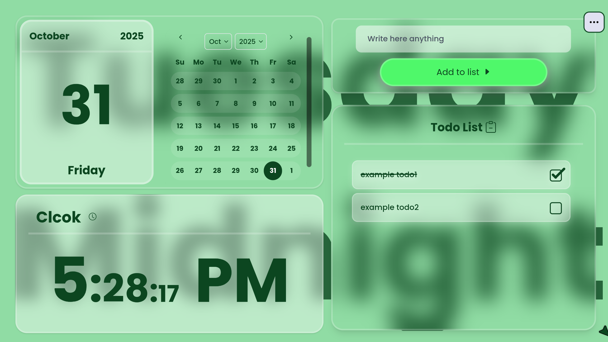

<div align="center">

# 📝 PlanPulse

### *The Ultimate Modern Todo Experience*



[](https://reactjs.org/)
[](https://vitejs.dev/)
[](https://tailwindcss.com/)
[](./LICENSE)

**A stunning, feature-rich todo application that transforms task management into an art form.**  
Built with bleeding-edge React 19, powered by Vite, and styled with Tailwind CSS 4.

[🚀 Live Demo](https://planpulse.vercel.app) • [🐛 Report Bug](https://github.com/aarab-abderrahmane/PlanPulse/issues) • [✨ Request Feature](https://github.com/aarab-abderrahmane/PlanPulse/issues)

</div>

---

## 🌟 Why PlanPulse?

PlanPulse isn't just another todo app—it's a **productivity powerhouse** wrapped in a gorgeous glassmorphic interface. Built from the ground up with modern web technologies, it offers unparalleled customization, smooth animations, and an experience that makes task management genuinely enjoyable.

<div align="center">


</div>

---

## ✨ Features That Set Us Apart

### 🎯 **Core Functionality**

<table>
<tr>
<td width="50%" valign="top">

#### Task Management
- ⚡ **Quick Task Creation** - Add tasks instantly with Enter key
- 🎨 **Inline Editing** - Edit tasks directly in place with smooth transitions
- ✅ **Animated Checkboxes** - Satisfying completion animations
- 🗑️ **Smart Deletion** - Confirmation dialogs prevent accidents
- 🔒 **Task Masking** - Hide sensitive tasks with blur effect via right-click
- 💾 **Auto-save** - Every change persists instantly to localStorage
- 📤 **Import/Export** - Backup and restore tasks as JSON files
- 🎯 **Context Menu** - Right-click for quick actions (Mask, Delete)

</td>
<td width="50%" valign="top">

#### Advanced Interactions
- 🔄 **Drag & Drop** - Reorder tasks effortlessly with @dnd-kit
- 🎊 **Celebration Effects** - Confetti animations on milestones
- 🔔 **Toast Notifications** - Color-coded feedback for every action
- 🌊 **Framer Motion** - Physics-based animations throughout
- ⌨️ **Keyboard Shortcuts** - Power-user productivity (Ctrl+B, Ctrl+Y)
- 🎬 **Welcome Stepper** - Interactive onboarding for new users
- 📱 **Fully Responsive** - Seamless experience across all devices

</td>
</tr>
</table>

---

### 🎨 **Customization Paradise**

#### 9 Stunning Themes
Choose from carefully crafted color schemes that transform your entire interface:

<div align="center">

🔵 **Blue** • 🔴 **Red** • 🟡 **Yellow** • 🟢 **Green** • 🟣 **Purple** • 🟠 **Orange** • 🔵 **Teal** • 🩷 **Pink** • ⚪ **Gray**


</div>

#### Visual Customization
- 🖼️ **10+ Background Patterns** - Pre-loaded textures or custom image uploads
- 🖱️ **Cursor Styles** - Choose between smooth animated or default cursor
- 📐 **Corner Radius Control** - Adjust borders from sharp to pill-shaped (0-3rem)
- 🎨 **Font System** - 8 beautiful fonts with adjustable weights (300-900)
- 🔆 **Opacity Control** - Fine-tune text transparency (0-100%)
- 👁️ **UI Visibility Toggle** - Hide/show background text for minimal interface
- 🎯 **Button Customization** - Show/hide edit and delete buttons per preference
- 🎭 **Glassmorphism UI** - Modern frosted-glass aesthetic throughout

---

### 🧩 **Dynamic Widget System**

<div align="center">


</div>

#### Powerful Widgets
- 📅 **Live Calendar** - Interactive date picker with month/year navigation
- ⏰ **Detailed Clock** - Real-time display with hours:minutes:seconds + AM/PM
- 🎯 **Smart Layout** - Drag widgets between sections or reorder within sections

#### Two Drag Modes
```javascript
// Items Mode → Reorder calendar & clock widgets
[Calendar, Clock] ↔ [Clock, Calendar]

// Sections Mode → Swap entire widget sections
[Calendar + Clock] ↔ [TodoList]
```

#### Quick Access Dock
- 🎯 **Floating Dock** - Quick layout customization controls
- 🔄 **Mode Toggle** - Switch between Items/Sections drag modes
- ↩️ **Reset Button** - Restore default layout instantly
- ❌ **Cancel** - Exit customization mode

---

## 🚀 Getting Started

### Prerequisites

```bash
Node.js 18.x or higher
npm / yarn / pnpm
Modern browser (Chrome, Firefox, Safari, Edge)
```

### Installation

```bash
# Clone the repository
git clone https://github.com/aarab-abderrahmane/PlanPulse.git

# Navigate to project directory
cd PlanPulse

# Install dependencies
npm install
# or
yarn install
# or
pnpm install
```

### Development

```bash
# Start development server
npm run planpulse

# Server runs at http://localhost:5173
# Hot module replacement enabled ⚡
```

### Production Build

```bash
# Build for production
npm run build

# Preview production build
npm run preview

# Lint codebase
npm run lint
```

---

## 📁 Project Architecture

```
PlanPulse/
├── 📂 src/
│   ├── 📂 components/
│   │   ├── 📂 ui/                         # 40+ shadcn/ui components
│   │   │   ├── accordion.jsx
│   │   │   ├── button.jsx
│   │   │   ├── calendar.jsx              # Date picker (react-day-picker)
│   │   │   ├── floating-dock.jsx         # Layout customization dock
│   │   │   ├── smooth-cursor.jsx         # Animated cursor
│   │   │   ├── confetti.jsx              # Celebration effects
│   │   │   ├── sparkles-text.jsx         # Animated text
│   │   │   └── ...
│   │   ├── 📂 PreferencesItems/
│   │   │   ├── backgroundAccordion.jsx   # Background selector carousel
│   │   │   └── fontAccordion.jsx         # Font selection interface
│   │   ├── TodoList.jsx                  # Main todo container with DnD
│   │   ├── List.jsx                      # Individual todo item (sortable)
│   │   ├── Checkbox.jsx                  # Animated checkbox component
│   │   ├── LiveCalendar.jsx              # Calendar widget
│   │   ├── LiveClockDetailed.jsx         # Clock widget with seconds
│   │   ├── Preferences.jsx               # Settings panel (40+ options)
│   │   ├── DropDownMenuLabo.jsx          # Main dropdown menu
│   │   ├── AlertConfirm.jsx              # Confirmation dialogs
│   │   └── error_404.jsx                 # Custom 404 page
│   ├── 📂 landingPage/
│   │   ├── indexlanding.jsx              # Animated landing page
│   │   ├── button.jsx                    # CTA button with effects
│   │   └── timeline-animation.jsx        # Feature timeline
│   ├── 📂 lib/
│   │   └── utils.js                      # Helper functions (cn, etc.)
│   ├── App.jsx                           # Root component with contexts
│   ├── Content.jsx                       # Router wrapper
│   ├── Stipper.jsx                       # Welcome onboarding flow
│   ├── ImportDataSection.jsx             # JSON import functionality
│   ├── ToastContext.jsx                  # Global toast notifications
│   ├── main.jsx                          # Application entry point
│   └── index.css                         # Global styles + CSS variables
├── 📂 public/
│   ├── 📂 backgrounds/                   # 10+ background patterns
│   ├── 📂 Demo/                          # Demo GIFs for README
│   └── *.png                             # Screenshots & assets
├── 📄 package.json                       # Dependencies & scripts
├── 📄 vite.config.js                     # Vite configuration
├── 📄 tailwind.config.js                 # Tailwind CSS config
├── 📄 components.json                    # shadcn/ui config
└── 📄 README.md                          # You are here!
```

---

## 🏗️ Technical Deep Dive

### State Management Architecture

PlanPulse uses React Context API for comprehensive, performant state management:

```javascript
// 🎨 Preferences Context - Theme, Layout & UI Settings
PreferencesContext = {
  appVersion: "3.0.0",
  font: { id: "font-8", weight: 500 },
  corners: 1.5,  // Border radius in rem
  background: { 
    active: false, 
    id: 0, 
    path: "" 
  },
  customizeLayout: [
    [{ id: 0, type: "calendar" }, { id: 1, type: "clock" }],
    [{ id: 2, type: "todoList" }]
  ],
  general: { 
    hideTexts: false,      // Hide background text
    opacityTexts: 100      // Text opacity percentage
  },
  cursorType: "smooth",    // "default" | "smooth"
  theme_name: "blue",      // Active theme key
  themes: { /* 9 themes */ },
  buttons: {
    buttonDelete: { active: false },
    buttonEdit: { active: true }
  },
  dragMode: { 
    active: false, 
    mode: "items"          // "items" | "sections"
  }
}

// 🔔 Toast Context - Global Notifications
ToastContext = {
  showToast: Function      // Display toast with color & message
}

// ✅ Todos Context - Task Operations
todosContext = {
  todos: Array<Todo>,
  setTodos: Function,
  MaskTodo: Function,      // Toggle blur effect
  handleAdd: Function,
  handleCheck: Function,
  handleEdit: Function,
  handleSave: Function,
  hanldeDelete: Function
}
```

### Data Models

```typescript
// 📝 Todo Item Structure
interface Todo {
  id: number;              // Unique identifier (timestamp-based)
  content: string;         // Task description (min 5 chars)
  modeEdit: boolean;       // Currently in edit mode?
  check: boolean;          // Completion status
  mask: boolean;           // Visibility state (blur toggle)
}

// 🧩 Widget Structure
interface Widget {
  id: number;              // Unique widget ID
  type: "calendar" | "clock" | "todoList";
}

// 📐 Layout Structure
type Layout = Widget[][];  // 2D array: [[left widgets], [right widgets]]

// 🎨 Theme Structure
interface Theme {
  "--color-background": string;  // Main background color
  "--color-text": string;        // Text color
  "--color-button": string;      // Primary button color
}
```

### Drag & Drop System

Powered by **@dnd-kit** for smooth, accessible interactions:

```javascript
// 🎯 DndContext Configuration
<DndContext
  onDragEnd={handleDragEnd}
  collisionDetection={closestCorners}
>
  <SortableContext 
    items={todos.map(todo => todo.id)}
    strategy={verticalListSortingStrategy}  // or horizontalListSortingStrategy
  >
    {/* Sortable items */}
  </SortableContext>
</DndContext>

// 🔄 Drag Modes
// Items Mode: Reorder calendar/clock within their section
// Sections Mode: Swap entire left ↔ right sections
```

---

## 💾 Data Persistence

### localStorage Keys & Formats

```javascript
// 1️⃣ Todos Data
Key: 'todos'
Format: Array<Todo>
Example: [
  { id: 1, content: "Buy groceries", check: false, modeEdit: false, mask: false },
  { id: 2, content: "Finish project", check: true, modeEdit: false, mask: false }
]

// 2️⃣ Preferences Data
Key: 'Preferences'
Format: PreferencesObject
Storage: Deep merged with defaults on load

// 3️⃣ Onboarding State
Key: 'hasVisited'  → boolean (landing page visit)
Key: 'hasStarted'  → boolean (stepper completion)
```

### Features
✅ **Auto-save** - Every state change persists instantly  
✅ **Graceful Loading** - Defaults provided if localStorage is empty  
✅ **Deep Object Merging** - New preferences merge with existing  
✅ **JSON Validation** - Import validates structure before loading  
✅ **Error Handling** - Fallbacks prevent data loss

---

## 🎨 Theming System

### CSS Variables Architecture

Customize themes by modifying CSS variables in `src/index.css`:

```css
:root {
  /* 🎨 Color System */
  --color-background: #90b5dc;  /* Primary background */
  --color-text: #0c2646;        /* Text & borders */
  --color-button: #4f83f8;      /* Interactive elements */

  /* 📐 Layout */
  --border-radius: 1.5rem;      /* Global corner radius */
  
  /* 🖋️ Typography */
  --font-family: 'Poppins', sans-serif;
  --font-weight: 500;
  
  /* 🖼️ Background (when active) */
  --background-name: url('/backgrounds/light-wool.png');
}
```

### Built-in Themes

<table>
<tr>
<td align="center" width="33%">

#### 🔵 Blue (Default)
`#90b5dc` background  
`#0c2646` text  
`#4f83f8` buttons

</td>
<td align="center" width="33%">

#### 🔴 Red
`#dc9090` background  
`#460c0c` text  
`#f84f4f` buttons

</td>
<td align="center" width="33%">

#### 🟡 Yellow
`#e6dc90` background  
`#46400c` text  
`#f8e14f` buttons

</td>
</tr>
<tr>
<td align="center">

#### 🟢 Green
`#90dca4` background  
`#0c4620` text  
`#4ff86a` buttons

</td>
<td align="center">

#### 🟣 Purple
`#b890dc` background  
`#2a0c46` text  
`#9b4ff8` buttons

</td>
<td align="center">

#### 🟠 Orange
`#f2b38a` background  
`#4a2308` text  
`#ff8c42` buttons

</td>
</tr>
</table>

*Plus: Teal, Pink, and Gray themes available!*

### Background Patterns

10+ pre-loaded seamless patterns from [Subtle Patterns](https://www.toptal.com/designers/subtlepatterns/):

- 🧱 Asfalt Light
- 📐 Batthern
- ⛪ Church
- 🧶 Light Wool
- ⭐ Starring
- 🧱 White Brick Wall
- 💎 White Diamond Dark
- 🔘 Worn Dots
- ⚡ Zig Zag

**Custom Upload:** Use your own images as backgrounds!

---

## 🔧 Technology Stack

### Core Framework
| Technology | Version | Purpose |
|------------|---------|---------|
| **React** | 19.2.0 | UI library with concurrent features |
| **React DOM** | 19.2.0 | React rendering engine |
| **Vite** | 7.1.7 | Lightning-fast build tool & dev server |
| **Tailwind CSS** | 4.1.16 | Utility-first CSS framework |

### UI & Animation
| Technology | Version | Purpose |
|------------|---------|---------|
| **Framer Motion** | 12.23.24 | Physics-based animations |
| **Styled Components** | 6.1.19 | CSS-in-JS styling |
| **Lucide React** | 0.546.0 | 1000+ beautiful icons |
| **Tabler Icons** | 3.35.0 | Additional icon library |
| **Canvas Confetti** | 1.9.4 | Celebration effects |

### Drag & Drop
| Technology | Version | Purpose |
|------------|---------|---------|
| **@dnd-kit/core** | 6.3.1 | Core drag-and-drop logic |
| **@dnd-kit/sortable** | 10.0.0 | Sortable list functionality |
| **@dnd-kit/utilities** | 3.2.2 | DnD helper utilities |

### Component Libraries
| Technology | Version | Purpose |
|------------|---------|---------|
| **Radix UI** | Various | 15+ accessible headless components |
| **shadcn/ui** | Latest | Pre-built styled components |
| **Sonner** | 2.0.7 | Toast notification system |
| **React Day Picker** | 9.11.1 | Calendar date picker |

### Utilities
| Technology | Version | Purpose |
|------------|---------|---------|
| **date-fns** | 4.1.0 | Date manipulation & formatting |
| **clsx** | 2.1.1 | Conditional className utility |
| **tailwind-merge** | 3.3.1 | Merge Tailwind classes intelligently |
| **React Router** | 7.9.5 | Client-side routing |

---

## ⌨️ Keyboard Shortcuts

Boost your productivity with power-user shortcuts:

| Shortcut | Action | Context |
|----------|--------|---------|
| `Ctrl + B` | Open/Close Preferences panel | Global |
| `Ctrl + Y` | Toggle Layout Customization Mode | Global |
| `Enter` | Add new todo | When input is focused |
| `Escape` | Cancel edit mode | When editing a task |
| `Right Click` | Open context menu | On todo items |

---

## 🌐 Browser Compatibility

<div align="center">

| Browser | Version | Support |
|---------|---------|---------|
|  | Latest | ✅ Fully Supported |
|  | Latest | ✅ Fully Supported |
|  | Latest | ✅ Fully Supported |
|  | Latest | ✅ Fully Supported |
|  | iOS 14+ | ✅ Fully Supported |
|  | Latest | ✅ Fully Supported |

</div>

*Requires JavaScript enabled and localStorage support*

---

## 🛣️ Roadmap

<div align="center">


</div>

### 🚧 In Development (v3.1.0)

- [x] 🔄 **Undo/Redo System** - Action history with Ctrl+Z/Ctrl+Shift+Z
- [x] ⌨️ **Extended Shortcuts** - More keyboard shortcuts for power users
- [ ] 🌙 **Dark Mode** - Automatic theme switching based on system preference
- [ ] 🔊 **Sound Effects** - Optional audio feedback for actions

### 📋 Planned (v4.0.0)

<table>
<tr>
<td width="50%" valign="top">

#### Organization
- [ ] 🏷️ **Tags & Categories** - Color-coded task organization
- [ ] 📁 **Multiple Lists** - Create separate lists for different projects
- [ ] 🔍 **Search & Filter** - Fuzzy search with advanced filtering
- [ ] ⭐ **Favorites** - Pin important tasks to the top
- [ ] 🔢 **Subtasks** - Nested task hierarchies

</td>
<td width="50%" valign="top">

#### Advanced Features
- [ ] 📅 **Due Dates** - Date picker with native reminders
- [ ] 🎯 **Priority Levels** - High/medium/low badges
- [ ] 📊 **Statistics Dashboard** - Productivity insights & charts
- [ ] 🔔 **Browser Notifications** - Native reminder system
- [ ] 🎙️ **Voice Input** - Add tasks via speech recognition

</td>
</tr>
<tr>
<td colspan="2">

#### Collaboration & Sync
- [ ] 👥 **Collaboration** - Share lists with team members
- [ ] ☁️ **Cloud Sync** - Multi-device synchronization
- [ ] 🔐 **User Accounts** - Secure authentication & data storage
- [ ] 📱 **PWA Support** - Install as native mobile app
- [ ] 🌍 **Internationalization** - Multi-language support

</td>
</tr>
</table>

### 🎯 Vision (v5.0.0+)

- 🤖 **AI Task Suggestions** - Smart task recommendations based on patterns
- 📈 **Productivity Analytics** - ML-powered insights & goal tracking
- 🎮 **Gamification** - Achievements, streaks, and rewards
- 🔗 **Integrations** - Connect with Google Calendar, Slack, Notion, etc.

---

## 🤝 Contributing

We love contributions! Whether it's bug fixes, new features, or documentation improvements, your help makes PlanPulse better for everyone.

### How to Contribute

1. **Fork the repository**
   ```bash
   # Click the "Fork" button on GitHub
   ```

2. **Clone your fork**
   ```bash
   git clone https://github.com/YOUR_USERNAME/PlanPulse.git
   cd PlanPulse
   ```

3. **Create a feature branch**
   ```bash
   git checkout -b feature/amazing-feature
   ```

4. **Make your changes**
   - Write clean, documented code
   - Follow existing code style
   - Add comments where necessary

5. **Test thoroughly**
   ```bash
   npm run lint       # Check for linting errors
   npm run planpulse  # Test in development
   npm run build      # Verify production build
   ```

6. **Commit with descriptive messages**
   ```bash
   git commit -m "feat: add amazing new feature"
   ```

7. **Push to your fork**
   ```bash
   git push origin feature/amazing-feature
   ```

8. **Open a Pull Request**
   - Describe your changes in detail
   - Reference any related issues
   - Wait for review and feedback

### Development Guidelines

- 📝 Use clear, descriptive variable names
- 🧪 Test your changes across different browsers
- 📱 Ensure mobile responsiveness
- ♿ Maintain accessibility standards
- 📚 Update documentation if needed

### Reporting Issues

Found a bug? Have a feature request? [Open an issue](https://github.com/aarab-abderrahmane/PlanPulse/issues) with:
- Clear title and description
- Steps to reproduce (for bugs)
- Expected vs actual behavior
- Screenshots (if applicable)
- Browser/device information

---

## 📄 License

This project is licensed under the **Creative Commons Attribution-NonCommercial 4.0 International (CC BY-NC 4.0)** license.

### ✅ You Are Free To:
- **Share** — Copy and redistribute the material in any medium or format
- **Adapt** — Remix, transform, and build upon the material

### 📋 Under The Following Terms:
- **Attribution** — Give appropriate credit with a link to this repository
- **NonCommercial** — Cannot be used for commercial purposes
- **No Additional Restrictions** — Cannot apply legal terms or tech measures that restrict others

📖 **Full License:** [CC BY-NC 4.0 Legal Code](https://creativecommons.org/licenses/by-nc/4.0/legalcode)

---

## 👨‍💻 Author

<div align="center">

### **Aarab Abderrahmane**

*Full-Stack Developer & UI/UX Enthusiast*

[](https://aarab-abderrahmane.vercel.app)
[](https://github.com/aarab-abderrahmane)
[](https://www.linkedin.com/in/aarab-abderrahmane-2b9509336/)
[](mailto:abderrahmanerb.contact@gmail.com)

</div>

---

## 🙏 Acknowledgments

This project wouldn't be possible without these amazing technologies and resources:

### 🛠️ Core Technologies
- [React](https://reactjs.org/) - The foundation of our UI
- [Vite](https://vitejs.dev/) - Lightning-fast build tool
- [Tailwind CSS](https://tailwindcss.com/) - Utility-first CSS framework
- [Framer Motion](https://www.framer.com/motion/) - Powerful animation library

### 🎨 UI & Components
- [Radix UI](https://www.radix-ui.com/) - Accessible component primitives
- [shadcn/ui](https://ui.shadcn.com/) - Beautiful component library
- [@dnd-kit](https://dndkit.com/) - Modern drag-and-drop toolkit
- [Lucide Icons](https://lucide.dev/) - Beautiful icon library
- [Sonner](https://sonner.emilkowal.ski/) - Toast notification system
- [React Day Picker](https://react-day-picker.js.org/) - Flexible date picker

### 🖼️ Design Resources
- [Subtle Patterns](https://www.toptal.com/designers/subtlepatterns/) - Background textures
- [Unsplash](https://unsplash.com/) - High-quality images
- [Coolors](https://coolors.co/) - Color palette inspiration

### 📚 Learning Resources
- [React Documentation](https://react.dev/) - Official React docs
- [Tailwind Docs](https://tailwindcss.com/docs) - Comprehensive CSS guide
- [MDN Web Docs](https://developer.mozilla.org/) - Web development reference

### 💡 Inspiration
- [TodoMVC](https://todomvc.com/) - Todo app examples
- [Dribbble](https://dribbble.com/) - Design inspiration
- [Awwwards](https://www.awwwards.com/) - Award-winning websites

---

## 📊 Project Stats

<div align="center">


</div>

---

<div align="center">

## 💖 Show Your Support

If PlanPulse helps you stay organized and productive, consider:

⭐ **Star this repository** - It helps others discover the project  
🐛 **Report bugs** - Help us improve the experience  
✨ **Request features** - Share your ideas for new functionality  
🤝 **Contribute code** - Make PlanPulse even better  
📢 **Spread the word** - Tell your friends and colleagues

---

### **Built with ❤️ by Aarab Abderrahmane**

*Making task management beautiful, one feature at a time.*

[⬆ Back to Top](#-planpulse)

---

**Happy Task Managing! ✅**

</div>
